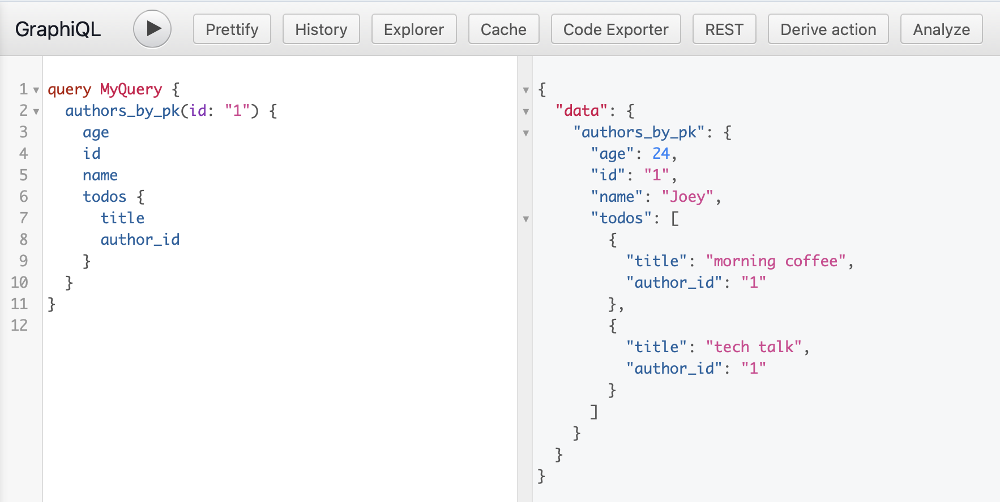

# A todo App using React Reley

- [Setup Environment](#setup_env)
- [Setup GraphQL](#setup_graphql)
- [Setup Relay](#setup_relay)

## Setup Environment<a name="setup_env" />

For detailed environment settings, please refer to this [doc](https://github.com/goplusgo/react-flow-template/blob/master/docs/Environment%20Setup.md).

## Setup GraphQL<a name="setup_graphql" />

Set up a free GraphQL backend service by using [Hasura](https://hasura.io). Follow this [video](https://www.youtube.com/watch?v=ydap0fFbI-Q) to set up your database and GraphQL endpoint.

For more details, see [Setup Hasura](./docs/Setup_Hasura.md).

After inserting three rows in it, now we're able to fetch the data through graphql endpoint with the following query:

```
query MyQuery {
  authors_by_pk(id: "1") {
    age
    id
    name
    todos {
      title
      author_id
    }
  }
}
```



## Setup Relay<a name="setup_relay" />

#### 1. Download GraphQL schema

Step 1: Download the `graphqurl` tool:

```
npm install -g graphqurl
```

Step 2: Download the schema from Harusa

```
gq https://ideal-vervet-75.hasura.app/v1/graphql -H "X-Hasura-Admin-Secret: adminsecretkey" --introspect > ./data/schema.graphql
```

> Note: replace the `adminsecretkey` with your real secret key

#### 2. Setup Relay Environment

Create a `RelayEnvironment.js` file with the following codes:

```javascript
async function fetchQuery(
  params: RequestParameters,
  variables: Variables,
): Promise<GraphQLResponse> {
  const response = await fetch(endpoint, {
    method: 'POST',
    headers: {
      'Content-Type': 'application/json',
      'x-hasura-admin-secret': 'adminsecretkey',
    },
    body: JSON.stringify({
      query: params.text,
      variables,
    }),
  });

  return response.json();
}

export default (new Environment({
  network: Network.create(fetchQuery),
  store: new Store(new RecordSource()),
}): Environment);
```

#### 3. Write Relay query and compile the code

Define the GraphQL query in `TodoApp.react.js`:

```javascript
const data = usePreloadedQuery(
  graphql`
    query TodoAppQuery($id: oid!) {
      authors_by_pk(id: $id) {
        id
        name
        age
        todos {
          id
          title
          author_id
        }
      }
    }
  `,
  props.queryRef,
);
```

Then, run:

```
yarn run relay
```

to generate Relay query definitions in `src/components/__generated__`.

Add codes in `index.js`:

```javascript
const preloadedQuery = loadQuery(RelayEnvironment, TodoAppQuery.default, {});

ReactDOM.render(
  <React.StrictMode>
    <RelayEnvironmentProvider environment={RelayEnvironment}>
      <ErrorBoundary FallbackComponent={ErrorFallback}>
        <Suspense fallback={'Loading...'}>
          <TodoApp queryRef={preloadedQuery} />
        </Suspense>
      </ErrorBoundary>
    </RelayEnvironmentProvider>
  </React.StrictMode>,
  document.getElementById('root'),
);
```

1. Relay can handle the response data automatically, and therefore, we only need to focus on successful data loaded state in specific component (See `TodoApp.react.js`).
2. It's best practice to wrap around `Suspense` and `ErrorBoundary` to handle **loading** and **error** states respectively.
