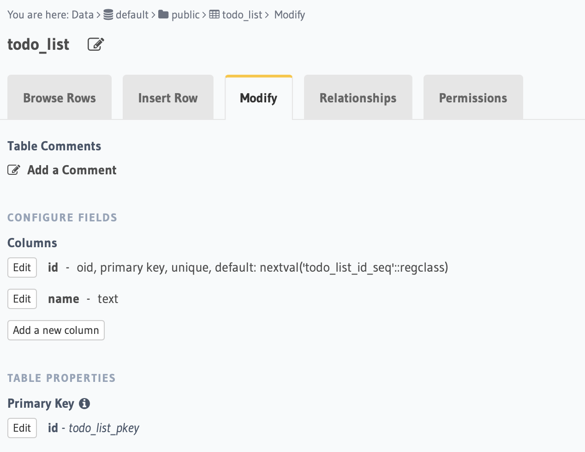
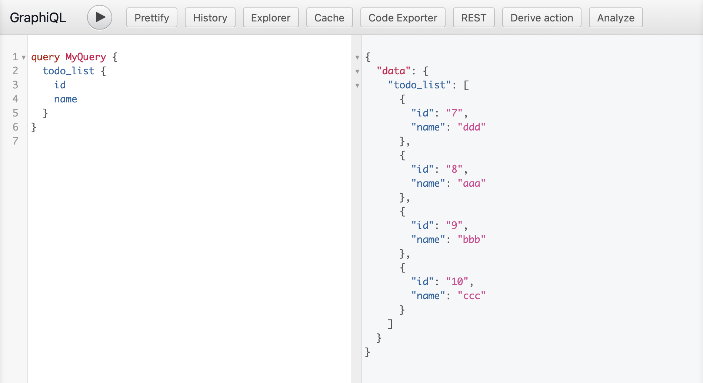

# A todo App using React Reley
## Project Setup

### 1. Create React App using Yarn
```
yarn create react-app relay-todo
```

### 2. Add Flow static type checker

**2.1 Setup Compiler**
```
yarn add --dev @babel/core @babel/cli @babel/preset-flow
```
Create a `.babelrc` file and add:
```json
{
  "presets": ["@babel/preset-flow"]
}
```
into it. 

**2.2 Setup Flow**
```
yarn add --dev flow-bin
yarn run flow init
yarn run flow
```

> Note: you might need to add `<PROJECT_ROOT>/.history/.*` under the `[ignore]` section of the `.flowconfig` file.

### 3. Setup Relay

**3.1 Installation**
```
yarn add react react-dom react-relay
```

**3.2 Set up the compiler​**
```
yarn add --dev relay-compiler
```

and add the script below into the `package.json` file:
```json
"scripts": {
  "start": "yarn run relay && react-scripts start",
  "build": "yarn run relay && react-scripts build",
  "relay": "yarn run relay-compiler $@"
}
```

also, add a `Relay` section:

```json
"relay": {
    "src": "./src/",
    "schema": "./data/schema.graphql"
  },
```

> Create the `./data/schema.graphql` locally.

**3.3 Set up babel-plugin-relay**

```
yarn add --dev babel-plugin-relay graphql
```

add the section below into `.babelrc`:
```json
"plugins": [
  "relay"
]
```

**3.4 Running the compiler**
```
yarn run relay
```

### 4. Setup GraphQL backend service
Set up a free GraphQL backend service by using [Hasura](https://hasura.io). Follow this [video](https://www.youtube.com/watch?v=ydap0fFbI-Q) to set up your database and GraphQL endpoint. 

Here is the basic db table schema I used:



After inserting three rows in it, now we're able to fetch the data through graphql endpoint with the following query:
```
query MyQuery {
  todo_list {
    name
  }
}
```



### 5. Setup Relay client + environment in React app
**5.1 Download GraphQL schema**
Step 1: Download the `graphqurl` tool:
```
npm install -g graphqurl
```

Step 2: Download the schema from Harusa
```
gq https://my-graphql-engine.com/v1/graphql -H "X-Hasura-Admin-Secret: adminsecretkey" --introspect > ./data/schema.graphql
```
> Note: replace the `adminsecretkey` with your real secret key

**5.2 Setup Relay Environment**

Create a `RelayEnvironment.js` file with the following codes:
```javascript
async function fetchQuery(
  params: RequestParameters,
  variables: Variables
): Promise<GraphQLResponse> {
  const response = await fetch(endpoint, {
    method: "POST",
    headers: {
      "Content-Type": "application/json",
      "x-hasura-admin-secret": "adminsecretkey",
    },
    body: JSON.stringify({
      query: params.text,
      variables,
    }),
  });

  return response.json();
}

export default (new Environment({
  network: Network.create(fetchQuery),
  store: new Store(new RecordSource()),
}): Environment);
```

**5.3 Import the environment and start to use Relay**
Define the GraphQL query in `TodoApp.react.js`:
```javascript
const data = usePreloadedQuery(
  graphql`
    query TodoAppQuery {
      todo_list {
        name
      }
    }
  `,
  props.queryRef
);

Then, run:
```
yarn run relay
```
to generate Relay query definitions in `src/components/__generated__`.

Add codes in `index.js`: 
```javascript
const preloadedQuery = loadQuery(RelayEnvironment, TodoAppQuery.default, {});

ReactDOM.render(
  <React.StrictMode>
    <RelayEnvironmentProvider environment={RelayEnvironment}>
      <ErrorBoundary FallbackComponent={ErrorFallback}>
        <Suspense fallback={"Loading..."}>
          <TodoApp queryRef={preloadedQuery} />
        </Suspense>
      </ErrorBoundary>
    </RelayEnvironmentProvider>
  </React.StrictMode>,
  document.getElementById("root")
);
```

1. Relay can handle the response data automatically, and therefore, we only need to focus on successful data loaded state in specific component (See `TodoApp.react.js`). 
2. It's best practice to wrap around `Suspense` and `ErrorBoundary` to handle **loading** and **error** states respectively.

