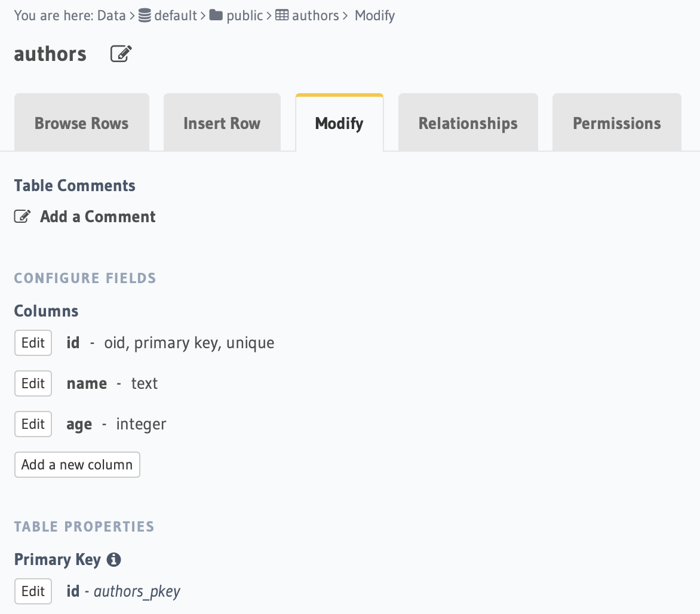
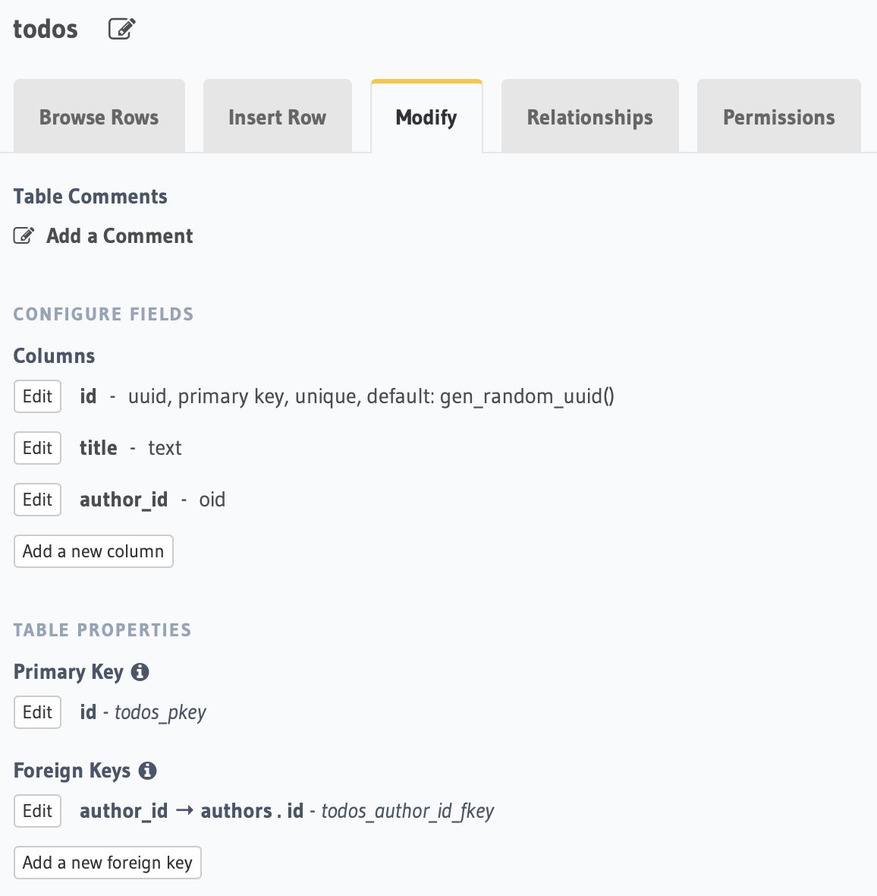
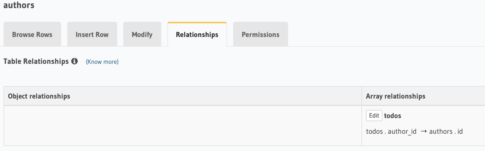
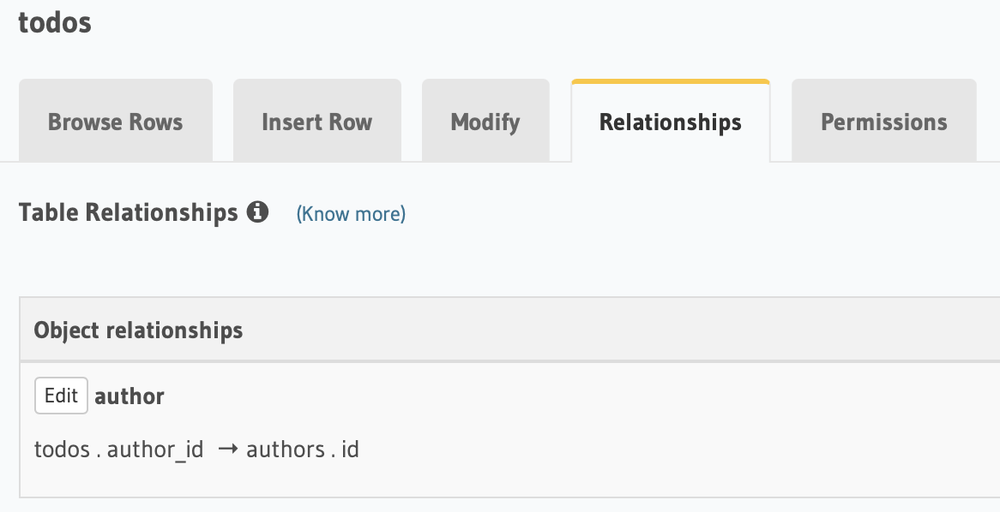

# Table of Contents

- [Table of Contents](#table-of-contents)
  - [Creating Tables<a name="create_tables" />](#creating-tablesa-namecreate_tables-)
    - [Authors](#authors)
    - [Todos](#todos)
  - [Adding Tables Relationship](#adding-tables-relationship)
    - [Authors Table Relationship](#authors-table-relationship)
    - [Todos Table Relationship](#todos-table-relationship)

## Creating Tables<a name="create_tables" />

### Authors

Creating a table called **authors** with the following configuration:

| column | type    |
| ------ | ------- |
| id     | oid     |
| name   | text    |
| age    | integer |

### Todos

Creating a table called **todos** with the following configuration:

| column    | type    |
| --------- | ------- |
| id        | uuid    |
| title     | text    |
| author_id | integer |

> Note: set the **author_id** as foreign key from the **authors** table.

## Adding Tables Relationship

Go to the **Relationship** tab and add object relationships for these two tables

### Authors Table Relationship

### Todos Table Relationship

